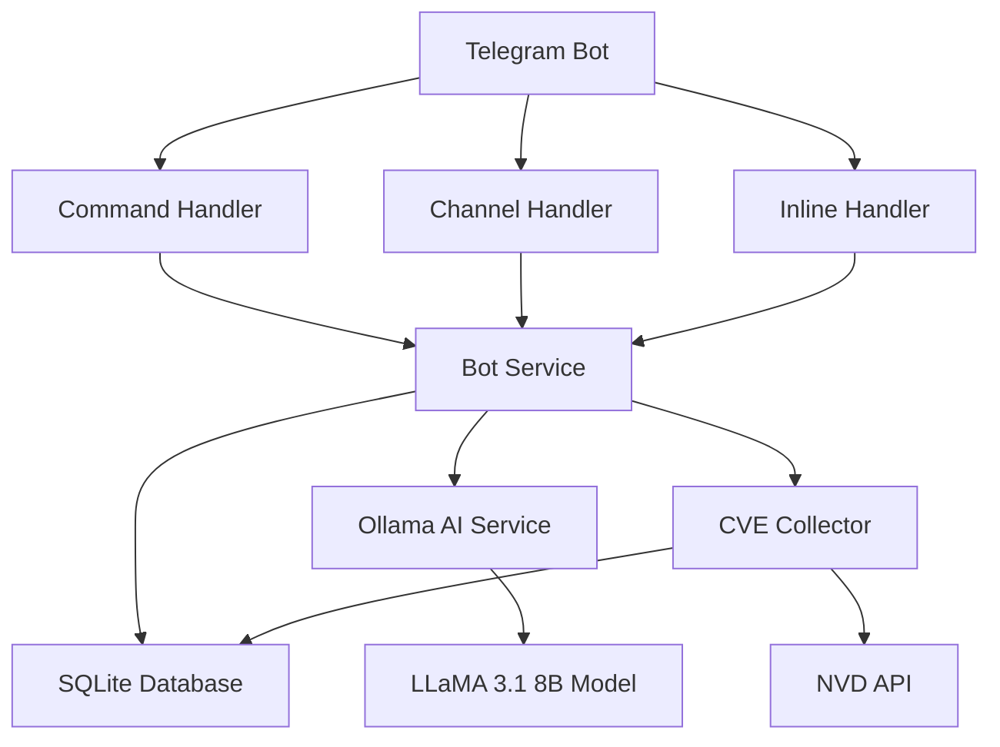

# 🤖 CVE Info Bot

[](https://python.org)
[](https://telegram.org)
[](https://ollama.ai)
[](https://sqlite.org)
[](LICENSE)
[]()

> **Intelligent Telegram bot for CVE vulnerability analysis with AI-powered insights**

A comprehensive Telegram bot that provides real-time CVE (Common Vulnerabilities and Exposures) information with AI-powered analysis. The bot monitors channels, responds to commands, and offers inline search capabilities with detailed vulnerability assessments.

---

## 🌟 Features

### 🔍 **Core Functionality**
- **311,921+ CVE Database** - Complete vulnerability database from NVD
- **AI-Powered Analysis** - Intelligent vulnerability assessment using LLaMA 3.1 8B
- **Real-time Monitoring** - Automatic CVE detection in Telegram channels
- **Channel Comments** - Automatic commenting on channel posts with CVE analysis
- **Inline Search** - Quick vulnerability lookup via `@cveinfobot`
- **Command Interface** - Rich command system for detailed queries

### 🤖 **Bot Commands**
- `/cve <CVE-ID>` - Get detailed vulnerability information
- `/vendor <name>` - Search vulnerabilities by vendor/product
- `/top` - Show most critical recent CVEs
- `/help` - Display available commands
- `@cveinfobot <query>` - Inline search in any chat

### 🧠 **AI Analysis**
- **Structured Reports** - Succinct, actionable vulnerability summaries
- **Risk Assessment** - Clear severity and impact analysis
- **Actionable Recommendations** - Specific remediation steps
- **Priority Guidance** - Criticality-based response priorities

### 📊 **Data Management**
- **Incremental Updates** - Hourly NVD data synchronization
- **Local Storage** - SQLite database for fast access
- **Rate Limiting** - Respectful API usage with proper throttling
- **Error Handling** - Robust error recovery and logging

---

## 🚀 Quick Start

### Prerequisites
- Python 3.8+
- Telegram Bot Token (from [@BotFather](https://t.me/botfather))
- Internet connection (for CVE data and AI model download)

### 🎯 One-Click Installation

#### Linux/macOS
```bash
# Clone and install (includes Ollama + LLaMA model)
git clone https://github.com/mrudybtw/cveinfobot.git
cd cveinfobot
chmod +x install.sh
./install.sh
```

#### Windows
```cmd
# Clone and install (includes Ollama + LLaMA model)
git clone https://github.com/mrudybtw/cveinfobot.git
cd cveinfobot
install.bat
```

> **Note**: Install scripts automatically:
> - Install Python dependencies
> - Install and configure Ollama
> - Download LLaMA 3.1 8B model (~4.7GB)
> - Set up logging and database
> - Create systemd service (Linux)

### 📝 Manual Installation

1. **Clone the repository**
   ```bash
   git clone https://github.com/mrudybtw/cveinfobot.git
   cd cveinfobot
   ```

2. **Install dependencies**
   ```bash
   pip install -r requirements.txt
   ```

3. **Configure environment**
   ```bash
   # Create .env file with your configuration
   echo "TELEGRAM_TOKEN=your_bot_token_here" > .env
   # Optional: Add NVD API key for higher rate limits
   echo "NVD_API_KEY=your_nvd_api_key_here" >> .env
   ```

4. **Start the bot** (database initializes automatically)
   ```bash
   python3 run_bot.py
   ```

### 🔧 Production Deployment

#### Linux Systemd Service
```bash
# Enable and start the service (after running install.sh)
sudo systemctl enable cveinfobot
sudo systemctl start cveinfobot
sudo systemctl status cveinfobot

# View logs
journalctl -u cveinfobot -f
```

#### Manual Service Management
```bash
# Start bot in background
nohup python3 run_bot.py > bot.log 2>&1 &

# Stop bot
pkill -f run_bot.py

# Check if running
ps aux | grep run_bot.py
```

---

## ⚙️ Configuration

### 🔐 Sensitive Data (.env file)
```bash
# Required
TELEGRAM_TOKEN=your_bot_token_here

# Optional (for higher NVD API limits)
NVD_API_KEY=your_nvd_api_key_here
```

### 🔧 Application Settings (config.py)
```python
# Database
DB_PATH = "db/cve.db"

# Logging
LOG_LEVEL = "INFO"
LOG_DIR = "logs"
TIMEZONE = "UTC+3"

# API Settings
NVD_UPDATE_INTERVAL = 3600  # 1 hour
OLLAMA_BASE_URL = "http://localhost:11434"
OLLAMA_MODEL = "llama3.1:8b"
```

### 📝 Configuration Architecture
- **`.env`** - Sensitive data (tokens, API keys)
- **`config.py`** - Application settings with defaults
- **Environment variables** - Override defaults when needed

---

## 📱 Usage Examples

### Command Interface
```
/cve CVE-2025-32463
```
**Response:**
```
🔴 CVE-2025-32463 - КРИТИЧЕСКИЙ

Продукт: sudo_project sudo
CVSS v3: 9.3
Дата: 30.06.2025

Описание:
Sudo before 1.9.17p1 allows local users to obtain root access...

🤖 AI-анализ:
🔍 Суть: Критическая уязвимость в sudo позволяет локальным пользователям получить root-доступ...
⚠️ Риски: Полное повышение привилегий до root...
🛠️ Действия: Немедленно обновить sudo до версии 1.9.17p1...
⏰ Приоритет: КРИТИЧЕСКИЙ
```

### Inline Search
```
@cveinfobot microsoft
```
Shows recent Microsoft vulnerabilities with CVSS scores and descriptions.

### Channel Monitoring & Comments
The bot automatically detects CVE patterns in channel messages and responds with detailed analysis:

- **Discussion Group Comments** - When channel has linked discussion group, bot posts comments there
- **Channel Replies** - When no discussion group exists, bot replies directly in the channel
- **AI Analysis** - Each comment includes full CVE details with AI-powered risk assessment
- **Multiple CVE Support** - Handles multiple CVE IDs in a single post

---

## 🏗️ Architecture

### System Components



### Database Schema

```sql
CREATE TABLE cve (
    id TEXT PRIMARY KEY,
    description TEXT,
    cvss_v3 REAL,
    vendor TEXT,
    product TEXT,
    published_date TEXT,
    epss REAL
);
```

### Data Flow

1. **Initialization** - Load complete CVE database from NVD
2. **Monitoring** - Continuous channel message analysis
3. **Detection** - CVE pattern recognition using regex
4. **Analysis** - AI-powered vulnerability assessment
5. **Response** - Formatted message with HTML rendering
6. **Updates** - Hourly incremental database synchronization

---

## ⚙️ Configuration

### Environment Variables

```bash
# Required
TELEGRAM_BOT_TOKEN=your_bot_token_here

# Optional
OLLAMA_URL=http://localhost:11434
OLLAMA_MODEL=llama3.1:8b
NVD_API_KEY=your_nvd_api_key_here
DB_PATH=db/cve.db
LOG_LEVEL=INFO
UPDATE_INTERVAL=3600
```

### BotFather Setup

1. Create bot with [@BotFather](https://t.me/botfather)
2. Enable inline mode: `/setinline`
3. Set inline placeholder: `/setinlinefeedback`
4. Add bot to channels as administrator
5. For channel comments: Create discussion group and link it to your channel

---

## 🧪 Testing

### Run Tests
```bash
python3 test_bot.py
```

### Monitor Progress
```bash
python3 monitor_progress.py
```

### Test Components
- Database connectivity
- CVE pattern detection
- AI service integration
- Telegram API communication

---

## 📈 Performance

### Database Statistics
- **Total CVEs**: 311,921+
- **Critical CVEs**: 2,500+ (CVSS ≥ 9.0)
- **Recent CVEs**: 10,000+ (2025)
- **Update Frequency**: Hourly
- **Response Time**: < 2 seconds

### Resource Usage
- **Memory**: ~200MB (with full database)
- **Storage**: ~500MB (SQLite database)
- **CPU**: Low (event-driven architecture)
- **Network**: Minimal (incremental updates)

---

## 🔧 Development

### Project Structure
```
cveinfobot/
├── bot/
│   ├── handlers/          # Message handlers
│   │   ├── command_handler.py    # Bot commands
│   │   ├── channel_handler.py    # Channel monitoring
│   │   └── inline_handler.py     # Inline queries
│   ├── services/          # Core services
│   │   ├── bot_service.py        # Main bot logic
│   │   ├── ollama_service.py     # AI analysis
│   │   └── collector.py          # CVE data collection
│   ├── utils/             # Utilities
│   │   └── logging_config.py     # Logging system
│   └── main.py           # Bot entry point
├── db/
│   ├── init_db.py        # Database initialization
│   └── cve.db           # SQLite database (auto-created)
├── logs/                 # Log files (auto-created)
│   ├── bot.log          # Main logs
│   └── errors.log       # Error logs
├── config.py            # Configuration
├── run_bot.py           # Main launcher script
├── requirements.txt     # Dependencies
└── README.md           # This file
```

### Adding New Features

1. **New Commands**: Add to `bot/handlers/command_handler.py`
2. **Database Changes**: Update `db/init_db.py` and migration scripts
3. **AI Enhancements**: Modify `bot/services/ollama_service.py`
4. **New Handlers**: Create in `bot/handlers/` and register in `main.py`

### Contributing

1. Fork the repository
2. Create feature branch (`git checkout -b feature/amazing-feature`)
3. Commit changes (`git commit -m 'Add amazing feature'`)
4. Push to branch (`git push origin feature/amazing-feature`)
5. Open Pull Request

---

## 📄 License

This project is licensed under the BEER-WARE LICENSE - see the [LICENSE](LICENSE) file for details.

---

## 🙏 Acknowledgments

- **NVD Team** - For providing comprehensive vulnerability data
- **Ollama Team** - For excellent local AI model hosting
- **Telegram Team** - For robust bot API platform
- **Open Source Community** - For invaluable tools and libraries

---

## 📞 Support

- **Issues**: [GitHub Issues](https://github.com/yourusername/cveinfobot/issues)
- **Discussions**: [GitHub Discussions](https://github.com/yourusername/cveinfobot/discussions)
- **Documentation**: [Wiki](https://github.com/yourusername/cveinfobot/wiki)

---

<div align="center">

**Made with ❤️ for the cybersecurity community**

[⭐ Star this repo](https://github.com/yourusername/cveinfobot) | [🐛 Report Bug](https://github.com/yourusername/cveinfobot/issues) | [💡 Request Feature](https://github.com/yourusername/cveinfobot/issues)

</div>

---

# 🇷🇺 CVE Info Bot (Русская версия)

> **Интеллектуальный Telegram бот для анализа уязвимостей CVE с ИИ-анализом**

Комплексный Telegram бот, который предоставляет информацию об уязвимостях CVE (Common Vulnerabilities and Exposures) в реальном времени с анализом на основе ИИ. Бот мониторит каналы, отвечает на команды и предлагает возможности инлайн-поиска с детальной оценкой уязвимостей.

## 🌟 Возможности

### 🔍 **Основной функционал**
- **База данных 311,921+ CVE** - Полная база уязвимостей из NVD
- **ИИ-анализ** - Интеллектуальная оценка уязвимостей с использованием LLaMA 3.1 8B
- **Мониторинг в реальном времени** - Автоматическое обнаружение CVE в каналах Telegram
- **Комментирование в каналах** - Автоматическое комментирование постов с анализом CVE
- **Инлайн-поиск** - Быстрый поиск уязвимостей через `@cveinfobot`
- **Командный интерфейс** - Богатая система команд для детальных запросов

### 🤖 **Команды бота**
- `/cve <CVE-ID>` - Получить детальную информацию об уязвимости
- `/vendor <название>` - Поиск уязвимостей по вендору/продукту
- `/top` - Показать самые критичные недавние CVE
- `/help` - Показать доступные команды
- `@cveinfobot <запрос>` - Инлайн-поиск в любом чате

### 🧠 **ИИ-анализ**
- **Структурированные отчеты** - Краткие, действенные сводки об уязвимостях
- **Оценка рисков** - Четкий анализ серьезности и воздействия
- **Практические рекомендации** - Конкретные шаги по устранению
- **Руководство по приоритетам** - Приоритеты реагирования на основе критичности

## 🚀 Быстрый старт

### Требования
- Python 3.8+
- Токен Telegram бота (от [@BotFather](https://t.me/botfather))
- Установленный Ollama с моделью LLaMA 3.1 8B

### Установка

1. **Клонируйте репозиторий**
   ```bash
   git clone https://github.com/yourusername/cveinfobot.git
   cd cveinfobot
   ```

2. **Установите зависимости**
   ```bash
   python3 setup.py
   ```

3. **Настройте окружение**
   ```bash
   cp .env.example .env
   # Отредактируйте .env с вашим токеном бота
   ```

4. **Инициализируйте базу данных и загрузите данные CVE**
   ```bash
   python3 load_cve_data.py
   ```

5. **Запустите бота**
   ```bash
   python3 run_bot.py
   ```

## 📱 Примеры использования

### Командный интерфейс
```
/cve CVE-2025-32463
```
**Ответ:**
```
🔴 CVE-2025-32463 - КРИТИЧЕСКИЙ

Продукт: sudo_project sudo
CVSS v3: 9.3
Дата: 30.06.2025

Описание:
Sudo before 1.9.17p1 allows local users to obtain root access...

🤖 AI-анализ:
🔍 Суть: Критическая уязвимость в sudo позволяет локальным пользователям получить root-доступ...
⚠️ Риски: Полное повышение привилегий до root...
🛠️ Действия: Немедленно обновить sudo до версии 1.9.17p1...
⏰ Приоритет: КРИТИЧЕСКИЙ
```

### Инлайн-поиск
```
@cveinfobot microsoft
```
Показывает недавние уязвимости Microsoft с оценками CVSS и описаниями.

### Мониторинг каналов и комментирование
Бот автоматически обнаруживает паттерны CVE в сообщениях каналов и отвечает детальным анализом:

- **Комментарии в группе обсуждений** - Когда канал связан с группой обсуждений, бот оставляет комментарии там
- **Ответы в канале** - Когда нет группы обсуждений, бот отвечает прямо в канале
- **ИИ-анализ** - Каждый комментарий включает полные детали CVE с оценкой рисков на основе ИИ
- **Поддержка множественных CVE** - Обрабатывает несколько CVE ID в одном посте

## 🏗️ Архитектура

### Компоненты системы


### Схема базы данных

```sql
CREATE TABLE cve (
    id TEXT PRIMARY KEY,
    description TEXT,
    cvss_v3 REAL,
    vendor TEXT,
    product TEXT,
    published_date TEXT,
    epss REAL
);
```

### Поток данных

1. **Инициализация** - Загрузка полной базы данных CVE из NVD
2. **Мониторинг** - Непрерывный анализ сообщений каналов
3. **Обнаружение** - Распознавание паттернов CVE с помощью regex
4. **Анализ** - Оценка уязвимостей на основе ИИ
5. **Ответ** - Форматированное сообщение с HTML-рендерингом
6. **Обновления** - Почасовая инкрементальная синхронизация базы данных

## ⚙️ Конфигурация

### Переменные окружения

```bash
# Обязательные
TELEGRAM_BOT_TOKEN=your_bot_token_here

# Опциональные
OLLAMA_URL=http://localhost:11434
OLLAMA_MODEL=llama3.1:8b
NVD_API_KEY=your_nvd_api_key_here
DB_PATH=db/cve.db
LOG_LEVEL=INFO
UPDATE_INTERVAL=3600
```

### Настройка BotFather

1. Создайте бота с [@BotFather](https://t.me/botfather)
2. Включите инлайн-режим: `/setinline`
3. Установите инлайн-заглушку: `/setinlinefeedback`
4. Добавьте бота в каналы как администратора
5. Для комментирования в каналах: Создайте группу обсуждений и свяжите её с каналом

## 🧪 Тестирование

### Запуск тестов
```bash
python3 test_bot.py
```

### Мониторинг прогресса
```bash
python3 monitor_progress.py
```

### Тестирование компонентов
- Подключение к базе данных
- Обнаружение паттернов CVE
- Интеграция ИИ-сервиса
- Связь с Telegram API

## 📈 Производительность

### Статистика базы данных
- **Всего CVE**: 311,921+
- **Критичные CVE**: 2,500+ (CVSS ≥ 9.0)
- **Недавние CVE**: 10,000+ (2025)
- **Частота обновлений**: Каждый час
- **Время отклика**: < 2 секунды

### Использование ресурсов
- **Память**: ~200MB (с полной базой данных)
- **Хранилище**: ~500MB (база данных SQLite)
- **CPU**: Низкое (архитектура на событиях)
- **Сеть**: Минимальное (инкрементальные обновления)

## 🔧 Разработка

### Структура проекта
```
cveinfobot/
├── bot/
│   ├── handlers/          # Обработчики сообщений
│   ├── services/          # Основные сервисы
│   └── main.py           # Точка входа бота
├── db/
│   └── init_db.py        # Инициализация базы данных
├── config.py             # Конфигурация
├── requirements.txt      # Зависимости
└── README.md            # Этот файл
```

### Добавление новых функций

1. **Новые команды**: Добавьте в `bot/handlers/command_handler.py`
2. **Изменения в базе данных**: Обновите `db/init_db.py` и скрипты миграции
3. **Улучшения ИИ**: Измените `bot/services/ollama_service.py`
4. **Новые обработчики**: Создайте в `bot/handlers/` и зарегистрируйте в `main.py`

### Вклад в проект

1. Форкните репозиторий
2. Создайте ветку функции (`git checkout -b feature/amazing-feature`)
3. Зафиксируйте изменения (`git commit -m 'Add amazing feature'`)
4. Отправьте в ветку (`git push origin feature/amazing-feature`)
5. Откройте Pull Request

## 📄 Лицензия

Этот проект лицензирован под лицензией MIT - см. файл [LICENSE](LICENSE) для деталей.

## 🙏 Благодарности

- **Команда NVD** - За предоставление комплексных данных об уязвимостях
- **Команда Ollama** - За отличный хостинг локальных ИИ-моделей
- **Команда Telegram** - За надежную платформу API ботов
- **Сообщество Open Source** - За бесценные инструменты и библиотеки

## 📞 Поддержка

- **Проблемы**: [GitHub Issues](https://github.com/yourusername/cveinfobot/issues)
- **Обсуждения**: [GitHub Discussions](https://github.com/yourusername/cveinfobot/discussions)
- **Документация**: [Wiki](https://github.com/yourusername/cveinfobot/wiki)

---

<div align="center">

**Сделано с ❤️ для сообщества кибербезопасности**

[⭐ Поставьте звезду этому репозиторию](https://github.com/yourusername/cveinfobot) | [🐛 Сообщить об ошибке](https://github.com/yourusername/cveinfobot/issues) | [💡 Запросить функцию](https://github.com/yourusername/cveinfobot/issues)

</div>